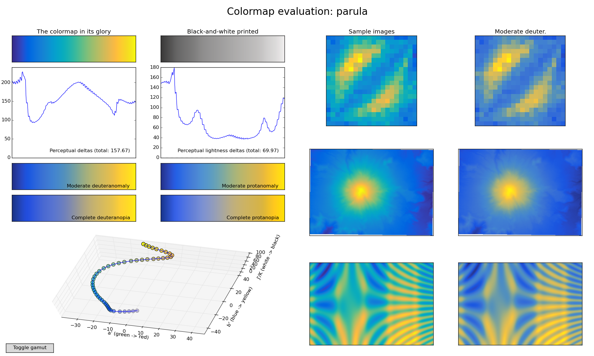
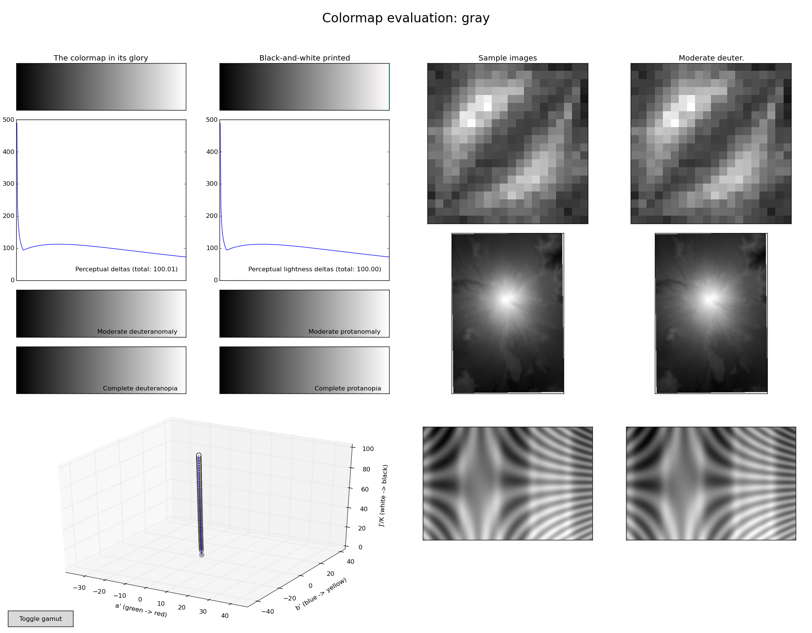
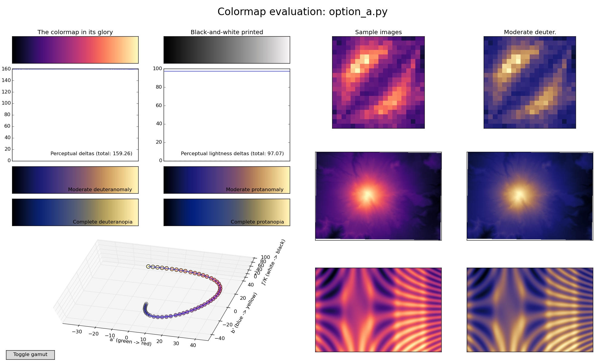
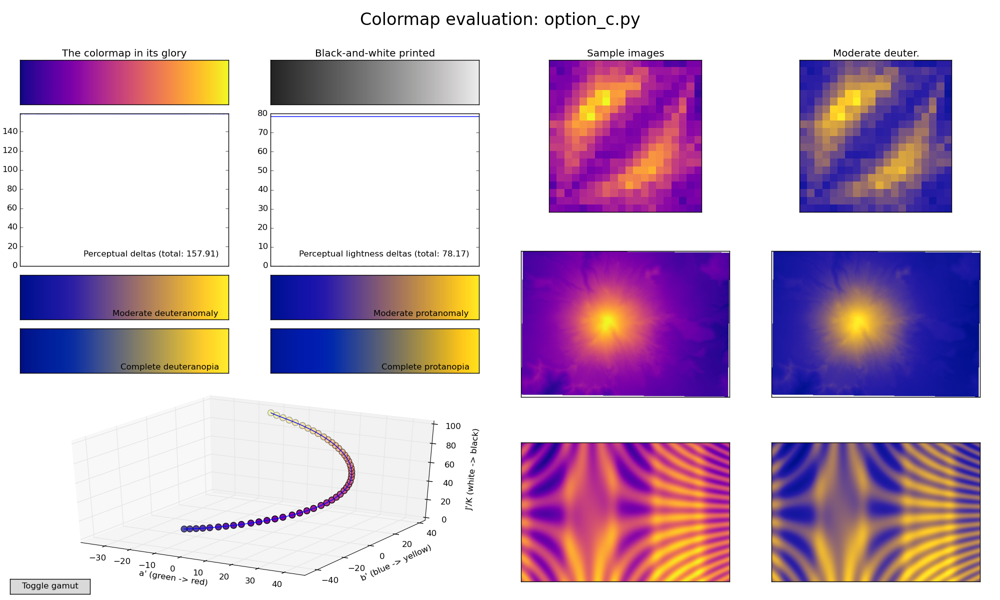
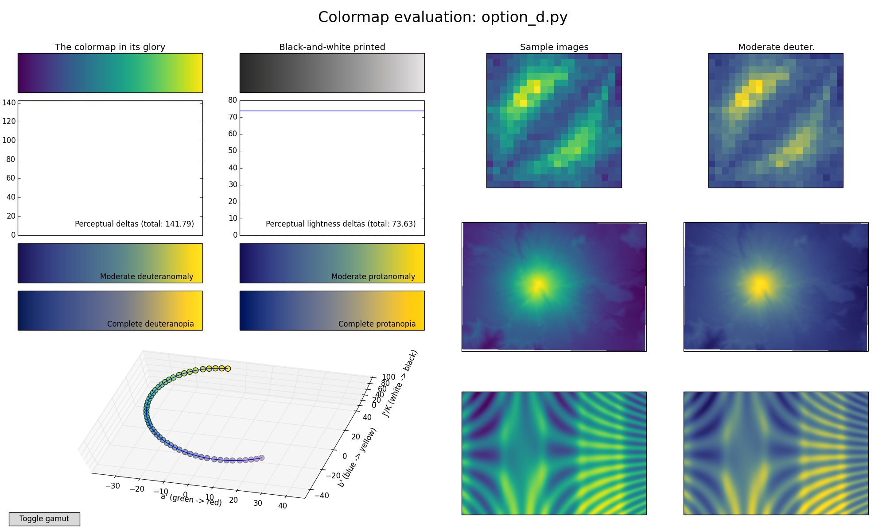

**Update:** *These colormaps
 [have been merged](https://github.com/matplotlib/matplotlib/pull/4707)
 into the development version of Matplotlib, all of them will be
 included in matplotlib 1.5, and "option D" (now called "viridis")
 [will be the new default colormap in matplotlib 2.0](http://matplotlib.org/style_changes.html). If you just
 want the colormaps themselves, they're [available in a
 single file here](https://github.com/BIDS/colormap/blob/master/colormaps.py)
 under a [CC0](https://creativecommons.org/about/cc0) "no rights
 reserved" license. Third
 parties have also made viridis available in
 [R](https://cran.r-project.org/web/packages/viridis/) and
 [Matlab](http://www.met.reading.ac.uk/~ed/viridis.m) and
 [JavaScript / D3](https://github.com/politiken-journalism/scale-color-perceptual). Below is the
 talk presented at SciPy2015 that outlines the whole story.*

<iframe width="560" height="315" src="https://www.youtube.com/embed/xAoljeRJ3lU" frameborder="0" allowfullscreen></iframe>

*The rest of this page is preserved for historical reference. If you
 have comments, concerns, or questions about the new colormaps, please
 get in touch via the matplotlib mailing list.*

---

This page gives an overview of the colormaps we (= Stéfan van der Walt
and Nathaniel Smith) have designed as potential replacements for
matplotlib's default, ``jet``.

First for comparison we show what several well-known colormaps look
like using a visualization tool we developed for assessing colormap
quality, and then give <del>3</del> 4 new colormaps that we've designed. We'd like
feedback on which one you like best!

<del>Please leave comments on
[this thread](http://thread.gmane.org/gmane.comp.python.matplotlib.devel/13522)
or [email us directly](mailto:njs@pobox.com)</del> (update: see
above).

## Well-known colormaps

### Jet

To start with, here's jet:

<a href="./images/screenshots/jet.png"></a>

You can click on the figure to expand it. The annotated parts are:

A) From top left to bottom right: the colormap, its grayscale version,
   perceptual deltas and perceptual lightness deltas.  Thereafter
   follows four different simulations of color blindness.

   A "perceptually uniform" colormap is one for which the "perceptual
   deltas" plot makes a simple horizontal line. (This is essentially
   the derivative of the colormap in perceptual space with respect to
   the data. We want our colormap to have the property that if your
   data goes from 0.1 to 0.2, this should create about the same
   perceptual change as if your data goes from 0.8 to 0.9. For color
   geeks: we're using CAM02-UCS as our model of perceptual distance.)

   You can see that jet is not perceptually uniform.

   The plot on the right is similar, but shows how perceptually
   uniform the colormap is if you print it in black-and-white. We
   again want this to be a flat horizontal line.

   Of the 4 colorblind simulations below, the upper-left one --
   "Moderate deuteranomaly" -- represents by far the most common
   form. It affects something like 5% of white men. (Well, this is a
   slight simplification because some people will have somewhat
   stronger or weaker colorblindness, and this just picks a single
   point in the middle of the scale. But that's good enough for
   present purposes.)

B) A 3-dimensional visualization of the colormap spline through
   CAM02-UCS color space. This is more interesting in the interactive
   version. The little dots are equally spaced in the data space, so
   "perceptually uniform" in this plot means that the dots should be
   equally spaced in the visualization. In the interactive version
   (see below) you can click on the "Toggle gamut" button to see an
   outline of which colors are actually possible in sRGB.

C) Example images colored with the test colormap (left column) and how
   it would be perceived by readers with the most common form of color
   blindness (right column).

### Parula

This is MATLAB(R)'s new default colormap.

<a href="./images/screenshots/parula.png"></a>

### Gray

Good old "gray":

<a href="./images/screenshots/gray.png"></a>


## Our new colormaps

We've made a few new colormaps, all using the same general bluish to
reddish to yellowish sequence, because this is relatively friendly to
common forms of colorblindness.

Each of these is designed in such a way that it will analytically be
perfectly perceptually-uniform, both in regular form and also when
converted to black-and-white. So we don't have to worry about that.

The main question at this point then is just aesthetics: which of
these do we want to "represent matplotlib's brand"?

### Option A (Magma)

<a href="./images/screenshots/option_a.png"></a>

### Option B (Inferno)

<a href="./images/screenshots/option_b.png"></a>

### Option C (Plasma)

<a href="./images/screenshots/option_c.png"></a>

### Option D (Viridis)

UPDATE: Here's a newly added greenish alternative option, based on a
[design by Eric Firing](http://thread.gmane.org/gmane.comp.python.matplotlib.devel/13522/focus=13542)
but with more yellow added at the top:

<a href="./images/screenshots/option_d.png"></a>

## A sample video using the above colormaps

A simulation of galaxy formation, courtesy Nathan Goldbaum. You can
watch the individual videos below, but I found it hard to compare
apples-to-apples this way, so I also made a mosaic of all of them
side-by-side, which you can <a
href="http://vorpus.org/~njs/goldbaum-galaxies-all-colormaps.mkv">download
here</a>. (I also uploaded to Youtube, but it ended up with terribly
artifacty downscaling. You can <a
href="https://www.youtube.com/watch?v=u9a4NO3iGgA">see here</a> if you
really want, but I recommend downloading the <a
href="http://vorpus.org/~njs/goldbaum-galaxies-all-colormaps.mkv">full-resolution
file</a> instead.)

Jet:

<iframe width="420" height="315" src="https://www.youtube.com/embed/dsvT5hImPmo" frameborder="0" allowfullscreen></iframe>

Parula:

<iframe width="420" height="315" src="https://www.youtube.com/embed/8146CMi-OaQ" frameborder="0" allowfullscreen></iframe>

Option A:

<iframe width="420" height="315" src="https://www.youtube.com/embed/IqvxuQSzWO4" frameborder="0" allowfullscreen></iframe>

Option B:

<iframe width="420" height="315" src="https://www.youtube.com/embed/wa7bpV3XPV0" frameborder="0" allowfullscreen></iframe>

Option C:

<iframe width="420" height="315" src="https://www.youtube.com/embed/3rHbq4jw1ew" frameborder="0" allowfullscreen></iframe>

Option D:

<iframe width="420" height="315" src="https://www.youtube.com/embed/2_HiUXVNm2k" frameborder="0" allowfullscreen></iframe>

## Appendix: How to generate these results or play around with these further

1. `pip install viscm`
2. Check out the
   [colormap scripts](https://github.com/bids/colormap). Each file
   provides a variable named `test_cm` which is a matplotlib colormap object.

To visualize matplotlib built-in colormaps:

```sh
python -m viscm show jet
```

To visualize one of our colormaps:

```sh
python -m viscm show path/to/colormap_script.py
```

To make a nice screenshot like the ones above:

```sh
python -m viscm show CMAP --save MYFILE.png --quit
```


If you want to access the editor interface we used to make these
colormaps and play around with designing your own variants:

```sh
python -m viscm edit path/to/colormap_script.py
```

It looks like this. We leave it as an exercise for the reader to play around
and figure out how it works--we may write up detailed docs later, but for now
just some simple usage instructions:

Drag to move spline control points, shift-click to add a control point,
control-click to delete a control point.  The bottom bars let you set the
min/max lightness, and click the colormap on the side to select which
hue/saturation slice of color space you want the left pane to show. (The game
is to keep the yellow dot inside the slice.)  If it starts acting weird try
tapping your modifier keys, sometimes that fixes things.

<a href="./images/screenshots/editor.png"></a>
