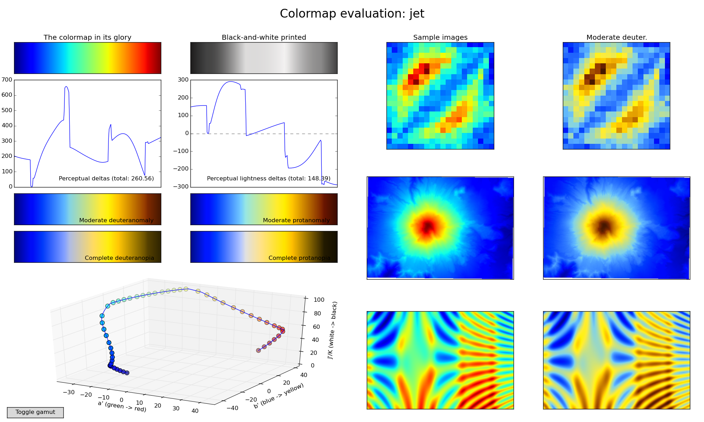

This page gives an overview of the colormaps generated as potential
replacements for matplotlib's default, ``jet``.

## Introduction

The ``viscm`` designer screen, used to define the 3-dimensionsional
spline path taken by the colormap through the CAM02-UCS color space.
This color space is transformed (warped) so that equal Euclidean
distances represent approximately equal jumps in human perceptual
difference.

<a href="./images/screenshots/editor.png"></a>

## Colormaps

Click on any of the figure below to expand.

### Black Purple

<a href="./images/screenshots/black-purple.png"></a>

### Black Purple Yellow

<a href="./images/screenshots/black-purple-yellow.png"></a>

### Parula

<a href="./images/screenshots/parula.png"></a>

### Gray

<a href="./images/screenshots/gray.png"></a>

### Jet

<a href="./images/screenshots/jet.png"></a>

## How to generate

1. Install the [pycam02ucs package](https://github.com/njsmith/pycam02ucs).
2. Check out and run any of the
   [colormap scripts](https://github.com/bids/colormap).

To explore other colormaps:

```python
import matplotlib.pyplot as plt
from pycam02ucs.cm.viscm import viscm

viscm('jet')

plt.show()
```
